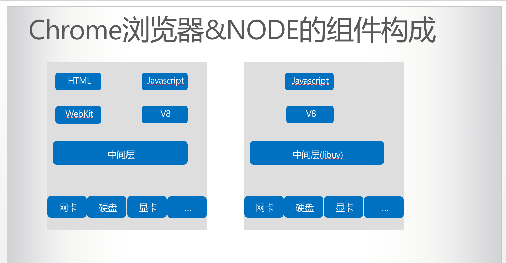
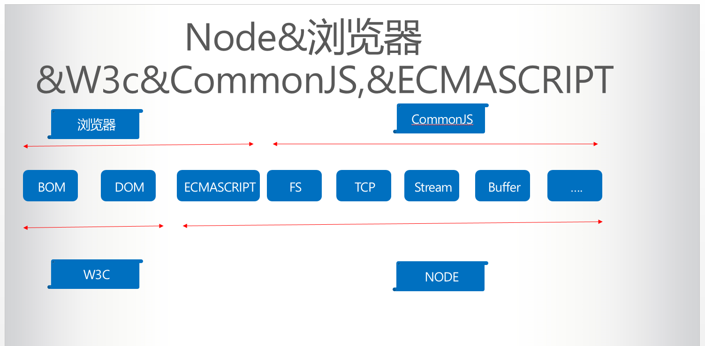
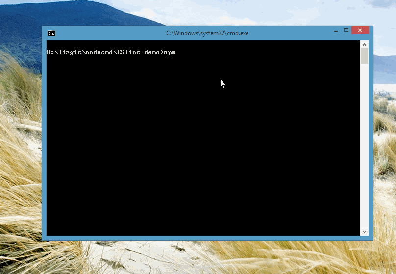
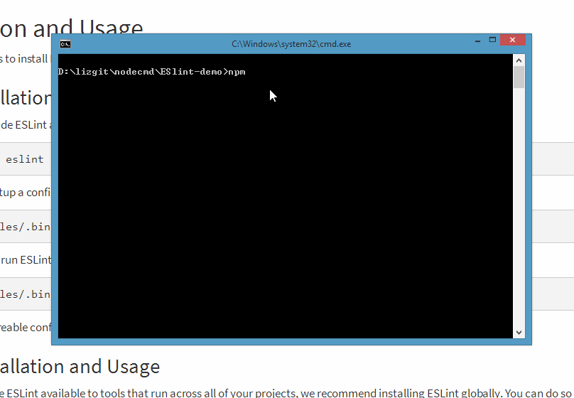
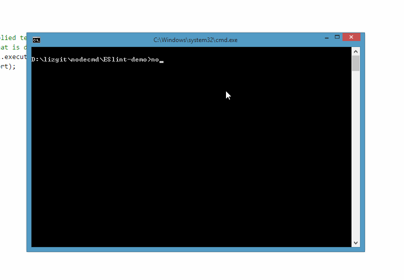

# 前端自动化

## 对NODE的误解

- NODE 肯定是几个前端工程师在实验室里捣鼓出来的。
- 为了后端而后端，有意思吗？
- 怎么又发明了一门新语言？
- javascript 承担的责任太重了
- 直觉上，JavaScript不应该运行在后端
- 前端工程师要逆袭了
## 图灵完备语言
一切可计算的问题都能计算，这样的虚拟机或者编程语言就叫图灵完备的。

一个能计算出每个图灵可计算函数（Turing-computable function）的计算系统被称为图灵完备的。一个语言是图灵完备的，意味着该语言的计算能力与一个通用图灵机 （Universal Turing Machine）相当，这也是现代计算机语言所能拥有的最高能力。

现在的计算机编程语言都是图灵完全（完备）的。

因此，这世上也不存在一种语言可以做，而另一种语言不可以做的事儿

## NODE
Ryan Dahl 是一名资深的程序员，在创造出NODE之前，他的主要工作都是围绕高性能Web服务器进行的。经历过一些尝试和失败之后，他找到了设计高性能Web服务器的几个要点：事件驱动，非阻塞I/O.

经过C,Lua,Haskell,Ruby,javascript等权衡最终选择的了javascript。

起初，Ryan Dahl称她的项目为web.js,就是一个Web服务器，但是项目的发展超过了他最初构想，变成了一个构建网络应用的基础框架。每个NODE进程都构成网络应用中的一个节点，这就是NODE名字所含意义的真谛。

虽然NODE这么酷炫但是我们都不用我们只用它写脚本。

### Chrome&Node


- [Electron](https://electron.atom.io/)
- [node-webkit](https://github.com/nwjs/nw.js)
- [React Native](http://reactnative.cn/cases.html)
### NODE&Browser&W3C&ECMASCRIPT


## NPM
npm 即node的安装包管理工具(就像nuget之于.NET,pip之于python)

[npm 命令手册](https://segmentfault.com/a/1190000004894400)

- npm -v 显示版本信息
- npm install <packageName> [--save]?
```
$ npm install sax@latest
$ npm install sax@0.1.1
$ npm install sax@">=0.1.0 <0.2.0"
```
- npm update
- npm -l //查看每个命令的用法
- npm info npm

- npm run 

```
npm install eslint  uglify-js --save
"scripts": {
  "lint": "eslint script.js ",
  "compile": "babel script.js",
  "uglifyjs ":"uglifyjs inet.js -o inet-min.js",
  "template": "node bin/templete.js",
  "launch": "launch.cmd",
  "build":"npm run lint &&npm run compile&&npm run launch"
},


```
## 指令&数据

这两个概念在计算机世界无处不在，一般数据的载体的就是文件，而这个文件在一定的环境下又变成了指令。如：一个HTML文件放在服务器上就是数据，而当浏览器获取了它，并将其解析绚丽的页面它就成了指令。

而前端主要由三种数据组成，HTML,CSS,JS，因此前端自动化就是用脚步自动化处理前端所涉及的数据（文件）。

而这个脚步呢就用NODE写，其一前端开发对JS技术栽比较熟悉容易上手，其二NODE社区灰常活跃你基本能找到你想要的所有东西。

不过大家在网上检索前端自动化，基本都会感觉前端自动化是grunt，gulp，webpack...,或者因为NODE才有了前端自动化。

其实一直都存在，只是之前更多的是java，python...的实现，就像现在找寻一些工具基本也都是java，python，ruby 版的。

## 前端自动化都做什么

- 压缩CSS，js。
- 预编译HTML，JS，CSS 前端涉及到的语言。HTML ，CSS 抽象程度比较低为了更高效的开发一般 HTML，css 由 jade，less 等DSL(Domain Specific Language)编译而成。
- 语法检查，格式整理，自动刷新页面等其它功能。
当前主流的所有工具，基本都会提供两种调用方式： CLI&NODE API
## 命令行程序

### PATH
```
PATH=
C:\Windows\system32;
C:\Windows;C:\Windows\System32\Wbem;
C:\Windows\System32\WindowsPowerShell\v1.0\;
C:\Program Files (x86)\nodejs\;
C:\Program Files\Git\cmd;
C:\Program Files\dotnet\;
C:\Program Files\TortoiseGit\bin;C:\Users\Zhuo.Li\AppData\Local\Programs\Python\Python35\Scripts\;
C:\Users\Zhuo.Li\AppData\Local\Programs\Python\Python35\;
C:\Users\Zhuo.Li\AppData\Roaming\npm;
```
### PATHEXT
```bash
C:\Users\Zhuo.Li>echo %PATHEXT%
.COM;.EXE;.BAT;.CMD;.VBS;.VBE;.JS;.JSE;.WSF;.WSH;.MSC
```
### Hello World
```bash
echo  Hello World
```
### node 全局命令调用方式
```bash
@IF EXIST "%~dp0\node.exe" (
  "%~dp0\node.exe"  "%~dp0\node_modules\gulp\bin\gulp.js" %*
) ELSE (
  @SETLOCAL
  @SET PATHEXT=%PATHEXT:;.JS;=;%
  node  "%~dp0\node_modules\gulp\bin\gulp.js" %*
)
```

## 模块组织
随着javascript发展，从增强显示的脚本到解决一类问题的库，然后构建应用，一个有效的模块加载方案也就成为了必须的元素。
因为当想用一个语言构建一个大型应用，模块机制不可或缺。
- 浏览器端运用最广泛的为 AMD 规范
- 服务端使用 CommonJS 规范
- 而ES6 Module 加载规范不远的将来将要统一前后端（我们要是采用ES6 加载规范）

-[javascript模块化编程](http://www.ruanyifeng.com/blog/2012/10/asynchronous_module_definition.html)

require AMD 写在回调中是因为如果同步等他浏览器可能会卡死.

### 关于javascriptIDE 目前功能薄弱的思考
javascript 尤其运行在浏览器端并没标准统一的入口，通过简陋的\<script\>标签引入，所以无法判断一个文件中出现的对象该有何种行为，而且script 还可能是动态加载的。
必然不能像其他语言那样智能检验差错与提示，如果以后模块化编程根深蒂固，javascriptIDE也会像其他语言一样强大。
有必要的话兴许还能实时预览，因为现在集成webkit渲染引擎开发桌面的应用正在蓬勃发展（比如我正在使用的vscode）


## AMD 

```javascript
define(['module1', 'module2'], function(m1, m2) {

    return {
        method: function() {
            m1.methodA();
			m2.methodB();
        }
    };

});

require(['foo', 'bar'], function ( foo, bar ) {
        foo.doSomething();
});
```
## cmomonjs
```javascript
//index.js
const m1=require("module1");

m1.dosomething()
.........

//module1
......

module.exports={
dosomething:function(){
    ....
}
}

```

## ES6


## ESlint

### npm init //https://github.com/advence-liz/nodecmd/blob/master/ 



### npm install


### node index.js



### package.json
```
{
  "name": "eslint-demo",
  "version": "1.0.0",
  "description": "a demo for eslint",
  "main": "index.js",
  "scripts": {
    "test": "npm run test"
  },
  "author": "liz",
  "license": "ISC",
  "dependencies": {
    "eslint": "^3.19.0"
  }
}
```
### index.js
```
"use strict";
var CLIEngine = require("eslint").CLIEngine;

var cli = new CLIEngine({
    envs: ["browser", "mocha"],
    useEslintrc: false,
    rules: {
        semi: 2
    }
});

// lint the supplied text and optionally set
// a filename that is displayed in the report
var report = cli.executeOnText("test.js");
console.dir(report);
```

## gulp
- [gulp入门教程](http://blog.csdn.net/xllily_11/article/details/51393569)
- [gulp-ruanyifeng](http://javascript.ruanyifeng.com/tool/gulp.html#toc3)
- [gulpjs](http://www.gulpjs.com.cn/docs/)
```
const gulp = require('gulp');
const eslint = require('gulp-eslint');
 
gulp.task('lint', () => {
    // ESLint ignores files with "node_modules" paths. 
    // So, it's best to have gulp ignore the directory as well. 
    // Also, Be sure to return the stream from the task; 
    // Otherwise, the task may end before the stream has finished. 
    return gulp.src(['**/*.js','!node_modules/**'])
        // eslint() attaches the lint output to the "eslint" property 
        // of the file object so it can be used by other modules. 
        .pipe(eslint())
        // eslint.format() outputs the lint results to the console. 
        // Alternatively use eslint.formatEach() (see Docs). 
        .pipe(eslint.format())
        // To have the process exit with an error code (1) on 
        // lint error, return the stream and pipe to failAfterError last. 
        .pipe(eslint.failAfterError());
});
 
gulp.task('default', ['lint'], function () {
    // This will only run if the lint task is successful... 
});
```

## grunt
```
require('load-grunt-tasks')(grunt); // npm install --save-dev load-grunt-tasks 
 
grunt.initConfig({
    eslint: {
        target: ['file.js']
    }
});
 
grunt.registerTask('default', ['eslint']);
```

-------


# 废稿

## javascript
1995年5月，Brendan Eich只用了10天，就设计完成了这种语言的第一版。它是一个大杂烩，语法有多个来源：

基本语法：借鉴C语言和Java语言。
数据结构：借鉴Java语言，包括将值分成原始值和对象两大类。
函数的用法：借鉴Scheme语言和Awk语言，将函数当作第一等公民，并引入闭包。
原型继承模型：借鉴Self语言（Smalltalk的一种变种）。
正则表达式：借鉴Perl语言。
字符串和数组处理：借鉴Python语言。
为了保持简单，这种脚本语言缺少一些关键的功能，比如块级作用域、模块、子类型（subtyping）等等，但是可以利用现有功能找出解决办法。这种功能的不足，直接导致了后来JavaScript的一个显著特点：对于其他语言，你需要学习语言的各种功能，而对于JavaScript，你常常需要学习各种解决问题的模式。而且由于来源多样，从一开始就注定，JavaScript的编程风格是函数式编程和面向对象编程的一种混合体。
## first-class

### 通常，编程语言会限制操作计算元素的途径。带有最少限制的元素被称为具有一等地位。一些一等元素的“权利和特权”是：

- 它们可以绑定到名称。
- 它们可以作为参数向函数传递。
- 它们可以作为函数的返回值返回。
- 它们可以包含在好素具结构中。
